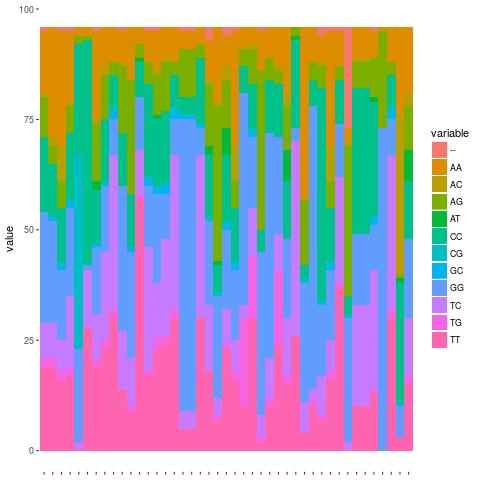

# SNP association to autism disorders

The aim of the project is to find gene Single Nucleotide Polymorphisms (SNP) and Copy Number Variation (CNP) association in genomic data from patient with Autism Syndrome Disorders (ASD). 

## Directories content
This repository contains the following directories:
* data - contains reports from beadStudio and GenomeStudio from SNP data.
* figures - images shown in this README intro file.
* scripts - to analyze data.

## 1. Frequencies of nucleotides

The following image shows the nucleotide composition of SNPs in chromosome
20 from 96 patients.

 

